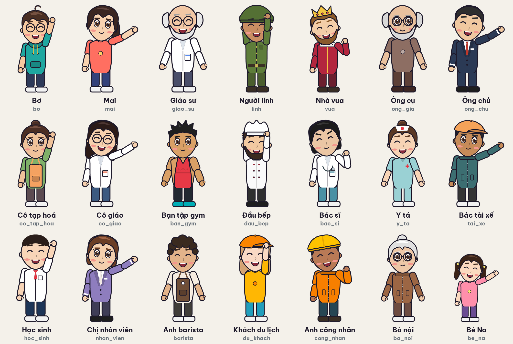
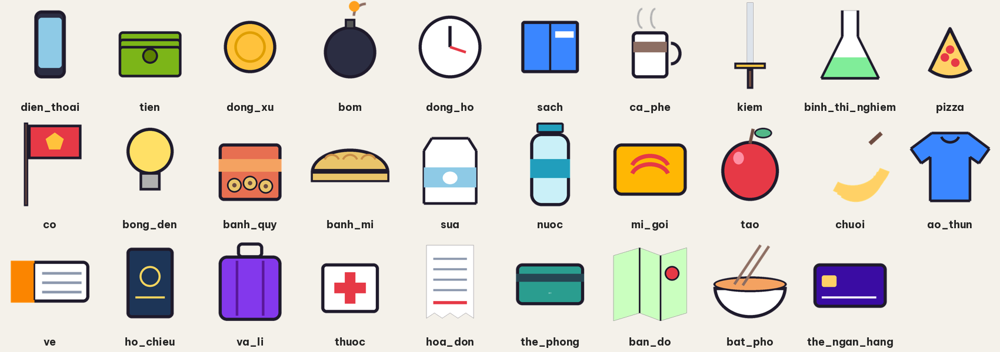
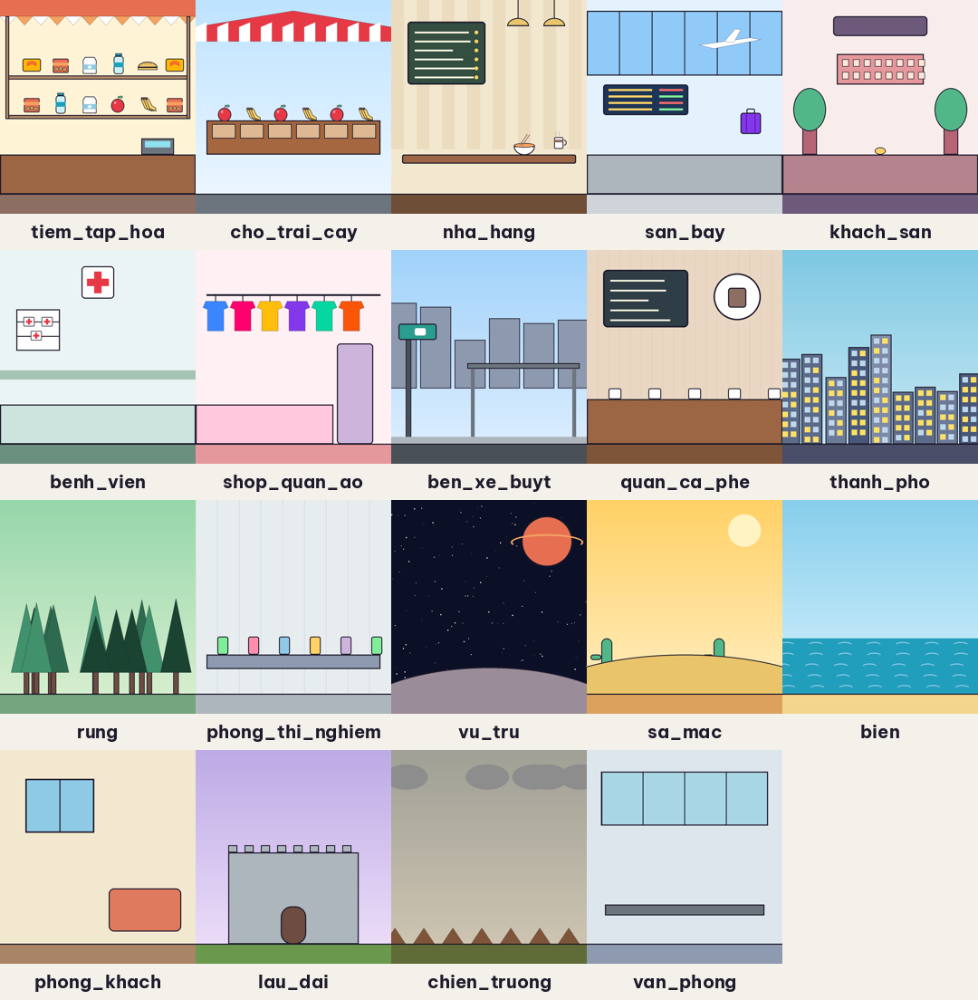

# Kế hoạch xây nhân vật riêng cho kênh (hoạt hình cắt ghép)

## ✅ Đã hoàn thành — dàn 21 nhân vật gốc của kênh (Full-HD)


| Mã (`character`) | Nhân vật | Vai trò / chủ đề hợp |
|---|---|---|
| `bo` | Bơ | người dẫn chuyện / người học |
| `mai` | Mai | cô bạn giỏi ngoại ngữ / người giảng |
| `giao_su` | Giáo sư | khoa học |
| `linh` | Người lính | lịch sử |
| `vua` | Nhà vua | lịch sử, quyền lực |
| `ong_gia` | Ông cụ | người lớn tuổi |
| `ong_chu` | Ông chủ | công sở, phỏng vấn, đàm phán |
| `co_tap_hoa` | Cô tạp hoá | mua sắm, mặc cả, chợ |
| `co_giao` | Cô giáo | trường học, ngữ pháp |
| `ban_gym` | Bạn tập gym | thể thao, sức khoẻ |
| `dau_bep` | Đầu bếp | nấu ăn, nhà hàng |
| `bac_si` | Bác sĩ | bệnh viện, sức khoẻ |
| `y_ta` | Y tá | bệnh viện |
| `tai_xe` | Bác tài xế | giao thông, taxi, hỏi đường |
| `hoc_sinh` | Học sinh | trường học, thi cử |
| `nhan_vien` | Chị nhân viên | văn phòng, khách sạn, lễ tân |
| `barista` | Anh barista | quán cà phê |
| `du_khach` | Khách du lịch | du lịch, sân bay, khách sạn |
| `cong_nhan` | Anh công nhân | công trường, việc làm |
| `ba_noi` | Bà nội | gia đình, truyền thống |
| `be_na` | Bé Na | trẻ em, gia đình, trường học |

- **Đạo cụ (`prop`):** 
- **Phông nền (`background`):** 
- **Cảnh 2 nhân vật:** điền `character2` và `action2`. Nhân vật 1 đứng bên trái, nhân vật 2 đứng bên phải và quay mặt vào nhau.
- **Tạo lại hoặc chỉnh dàn nhân vật:** sửa danh sách `CAST` trong `studio/cast.py` (màu da, tóc, áo, mũ, kính, râu), rồi chạy
  `python -m studio.cast`. Thêm nhân vật mới chỉ cần thêm 1 dòng `Look(...)`.
- Muốn thay bằng tranh do hoạ sĩ vẽ tay: làm theo các phần bên dưới, **giữ nguyên tên file và khung xương**.

---

Kênh kiểu infographic không vẽ lại từng khung hình. Họ dùng **hoạt hình cắt ghép (cutout)**: mỗi nhân vật
tách thành nhiều bộ phận, gắn khớp xoay, rồi tái sử dụng một **thư viện động tác** cho mọi video. App đã có
sẵn engine này (`studio/character.py`). Việc của bạn là **thiết kế nhân vật riêng** theo đúng cấu trúc bên dưới.

## Lộ trình (khoảng 4–6 tuần, làm song song với việc đăng video)

| Giai đoạn | Việc làm | Kết quả |
|---|---|---|
| **1. Định hình (tuần 1)** | Chọn 1 nhân vật dẫn chuyện chính: dáng, màu, 1 chi tiết nhận diện (mũ, kính, kiểu tóc…). Vẽ phác 3 góc: thẳng, nghiêng ¾, sau lưng | Bản thiết kế nhân vật (model sheet) |
| **2. Tách bộ phận (tuần 2)** | Vẽ bằng vector (Inkscape, miễn phí, hoặc Illustrator/Affinity). Tách thành các lớp theo bảng bộ phận, xuất PNG | Thư mục `assets/characters/<tên>/` |
| **3. Gắn khớp (tuần 2)** | Mở từng PNG, ghi toạ độ khớp (pivot) vào `rig.json`. Chạy `python -m studio.preview <tên>` để xem bảng tư thế, rồi chỉnh đến khi khớp không bị hở | Nhân vật chạy được trong app |
| **4. Biểu cảm (tuần 3)** | Vẽ biến thể mắt, miệng, lông mày. Tối thiểu: 4 mắt, 5 miệng, 4 lông mày | Nhép miệng + biểu cảm |
| **5. Dàn diễn viên (tuần 3–4)** | Vẽ thêm 2–4 nhân vật phụ **dùng chung khung xương** (chỉ thay đầu, tóc, áo): nhà khoa học, lính, vua… | Kể được nhiều loại chủ đề |
| **6. Đạo cụ & bối cảnh (tuần 4–6)** | Kho đạo cụ (điện thoại, tiền, bom, đồng hồ…) và 10–20 phông nền hay dùng (thành phố, rừng, phòng thí nghiệm, vũ trụ…) | Thư viện tái sử dụng |
| **7. Mở rộng động tác (liên tục)** | Mỗi khi kịch bản cần động tác mới (ngồi, ngã, đánh nhau…), thêm keyframe vào `ACTIONS` | Thư viện động tác lớn dần |

## Bảng bộ phận của khung xương chuẩn (bắt buộc)

| Tên bộ phận (`name`) | File | Khớp cha | Khớp (pivot) nằm ở |
|---|---|---|---|
| `body` | body.png | (gốc) | **giữa đáy thân** (hông) |
| `head` | head.png | body | **giữa cổ** (đáy đầu) |
| `arm_l`, `arm_r` | arm.png | body | **vai** (đỉnh cánh tay) |
| `forearm_l`, `forearm_r` | forearm.png | arm_* | **khuỷu tay** (đỉnh cẳng tay; nên vẽ luôn bàn tay) |
| `leg_l`, `leg_r` | leg.png | body | **hông** (đỉnh chân; nên vẽ luôn bàn chân) |

Mặt (vẽ riêng, dán lên đầu tại `face_anchor`):
- `eyes_mo`, `eyes_nham` (dùng khi chớp mắt), `eyes_to` (khi sốc), `eyes_nheo` (khi cười/nghĩ)
- `mouth_ngam`, `mouth_vua`, `mouth_to` (3 mức nhép miệng), `mouth_buon`, `mouth_cuoi`
- `brows_binh_thuong`, `brows_cau` (giận), `brows_nhuong` (ngạc nhiên), `brows_buon`

## Quy tắc vẽ để khớp đẹp
1. **Vẽ nhân vật đứng thẳng, hai tay buông dọc thân** (tư thế nghỉ), nhìn thẳng. Cao khoảng 700 px (đầu tới chân).
2. **Đầu khớp bo tròn và chồng lên nhau khoảng 20 px** (vai, khuỷu, hông) để khi xoay không lộ khe hở.
3. **PNG nền trong suốt, cắt sát nội dung.** Khớp nên nằm cách mép ảnh khoảng nửa bề rộng chi.
4. **Nét viền đều 6–10 px, màu phẳng, tối đa 1 lớp đổ bóng.** Giữ đúng phong cách này cho mọi nhân vật và đạo cụ.
5. **Tay/chân trái và phải dùng chung 1 file.** Tay phải nằm lớp trên thân (`z` lớn), tay trái nằm lớp dưới.
6. **Đầu to** (khoảng 1/3 chiều cao) thì biểu cảm dễ đọc trên màn hình điện thoại.

## `rig.json` — ví dụ rút gọn
```json
{
  "name": "Nam dẫn chuyện", "height": 700,
  "parts": [
    {"name": "body", "image": "body.png", "pivot": [95, 240], "parent": null, "z": 3},
    {"name": "head", "image": "head.png", "pivot": [125, 235], "parent": "body", "offset": [0, -230], "z": 5},
    {"name": "arm_r", "image": "arm.png", "pivot": [30, 25], "parent": "body", "offset": [80, -205], "z": 6, "rest": -10}
  ],
  "face": {"eyes": {"mo": "eyes_mo.png"}, "mouth": {"ngam": "mouth_ngam.png"}},
  "face_anchor": {"brows": [125, 70], "eyes": [125, 115], "mouth": [125, 180]},
  "expressions": {"vui": {"eyes": "nheo", "mouth": "cuoi"}}
}
```
- `pivot`: toạ độ khớp tính **trong ảnh của chính bộ phận đó**.
- `offset`: vị trí khớp này tính **từ khớp của bộ phận cha**.
- `rest`: góc nghỉ (độ).

Nhân vật mẫu (`assets/characters/mau/`, được tự tạo khi chạy lần đầu) là ví dụ đầy đủ, có thể copy làm khung.

## Dùng trong video
Trong bảng kịch bản của app, mỗi cảnh có thêm các cột:
- `character`: tên thư mục nhân vật. Để trống nếu cảnh không có nhân vật.
- `action`: dung, di_bo, chay, chi_tay, vay_tay, suy_nghi, bat_ngo, vui_mung, buon, run_so
- `expression`: vui, soc, buon, gian, nghi. Để trống thì dùng biểu cảm mặc định của động tác.
- `position`: trai, giua, phai. Với các động tác di chuyển, `phai` nghĩa là đi từ phải sang trái.

Khi cảnh có nhân vật, ảnh AI hoặc thẻ đồ hoạ của cảnh đó trở thành **phông nền**. App tự thêm "no people"
vào prompt để Stable Diffusion không vẽ người, và tự vẽ phông nền phẳng khi không dùng GPU.

## Công cụ miễn phí gợi ý
- **Inkscape**: vẽ vector, xuất PNG từng lớp (Export → Batch export).
- **Krita**: vẽ tay nếu bạn thích nét cọ.
- **Blender (Grease Pencil) / OpenToonz**: khi cần cảnh hành động phức tạp mà khung xương không làm được.
  Xuất ra PNG hoặc video rồi đưa vào cột `visual` như một ảnh riêng.

## Bước tiếp theo trong app (đề xuất)
- Thêm đạo cụ gắn vào tay (`prop` cột mới, dán vào khớp `forearm_r`).
- Cho phép 2 nhân vật trong cùng một cảnh (hội thoại, đối đầu).
- Nhép miệng chính xác theo âm vị bằng Rhubarb Lip Sync (mã nguồn mở).
